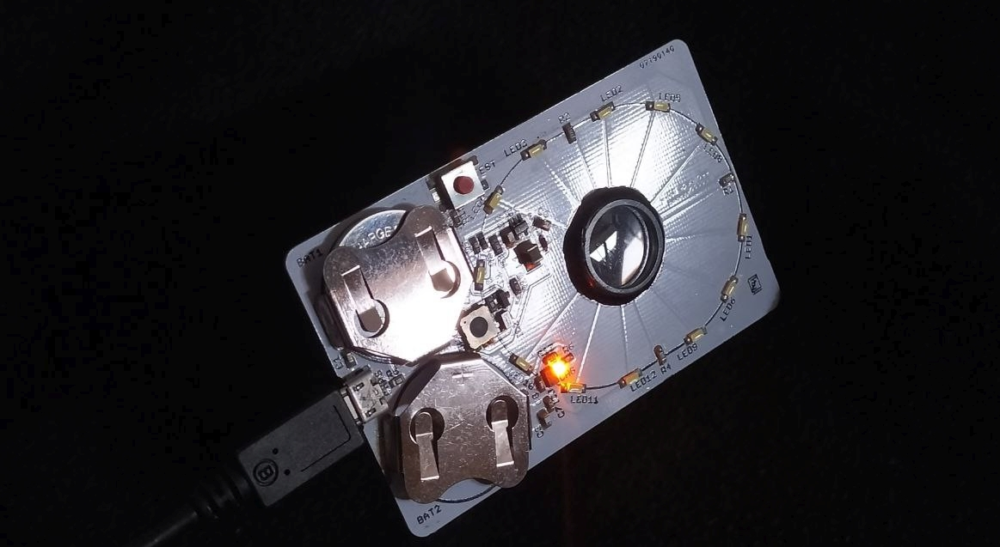

# LEDCard

A credit card - sized, slim ring light with a  Li-Ion powered LED ring light for high quality macro shots everywhere you go.

## Revisions

### LEDCard-1A : first prototype

Ideas:

- LED ring light
- macro lens
- battery-powered
- notches to be able to fix it to a device with rubber bands

Classic mistake: the photomask was flipped, so the SOT23-5 IC also had to be assembled on its back. Macro shot for entertainment purposes:

Insights:

- LED efficiency too low (~50 lm/W)
- CR2032 batteries inadequate
- Inrush current may lead to contact degradation of the push button over time.

Switch from FAN5331 (Rds(ON) = 0.5 Ohm, 1.6 MHz) to LM3410Y (Rds(ON) = 0.17 Ohm, 0.525 MHz and 1.6 MHz options):

<table><thead><tr>
<td><a href="doc/FAN5331.pdf">FAN5331</a></td>
<td><a href="doc/LM3410.pdf">LM3410</a></td>
</tr></thead><tbody><tr>
<td></td>
<td></td>
</tr></tbody></table>

### LEDCard-1D : LIR2430 cells and charging via USB

Ideas:
- Switch to LIR2430 rechargable Li-Ion button cells (60-70 mAh, Ichg = 50 mA, RS Part No.: 183-4294)
- Push button now switches ENA instead of VCC.
- Two power levels (ON / ON+HI) for medium and max brightness.
- Replace FAN5331 with LM3410.

Insights:

- Li-Ion cells can deep discharge and be destroyed.
- MCP73831 Li-Ion charging IC developed an intermittent solder joint after > 1 year of use in wallet, probably due to flexural stresses. Switch to MSOP recommended.
- 1.0mm FR4 is not stiff enough. Switch to 0.4mm or 0.6 mm FR4 and laminate onto laser-cut and deburred Ti sheet metal (see cad/ folder for .dxf file).
- ON button should raise MCP73831 charge current to allow USB-powered operation with a cable plugged in.

### LEDCard-1E : Battery Protection Update, Half-Press Button, Low Batt TEST

Ideas:

- Disable the boost converter when battery voltage under load drops below 2.5V (internal resistance is significant, maximum discharge current 2*60 mA is not great but can only be addressed with better / bigger cells or fragile pouch cells).
- Manage two power levels with a single push button that allows intuitive half / full press.
- Battery Level Test: half-press SW1 so the LED light turns on. When pressing TEST, the LEDs should turn off. Once they stay lit, the battery level is low. This works by forming a voltage divider to VCC. As VCC drops, FB is low enough to cause the boost converter to turn back on.
- TEST button at the edge does not cause the LEDCard to turn on when pressed accidentally.

Insights:

- Half press button is unpleasant, needs a printed / formed button cap to be useful. Idea to shield the button with battery clips around it is effective at preventing accidental presses, but also makes use harder.
- Tantalum capacitor in the picture was experimental and helped demonstrate that operation with USB connected is not possible without raising the charger current in LED on mode.
- SMD slider switch would be nice to enable continuous / hands-free operation (especially when USB is plugged in).
- USB-C to be considered for next iteration.
- LIR2430 cell found to be dead after 2 years of storage. Remove cells when not in use for > 4 weeks.
- FR4 front cover / diffusor would be nice. maybe 3D print with clear PETG?

#### LEDCard-1E Schematic

#### LEDCard-1E Layout

#### Lenses

16.5mm diameter molded acrylic lenses:

- https://astromedia.de/Opti-Media-Linse-OM4
- https://astromedia.de/Opti-Media-Linse-OM5
- https://astromedia.de/Opti-Media-Linse-OM6

Monted with clear epoxy (Uhu Endfest). For mounting, put Al tape on the back of the LEDCard PCB and place the lens in its designated location. Rub the tape to get complete adhesion without air pockets to avoid seeping of the epoxy.

## Changes

* 2022-12: project files recovered, documentation added. First release.
* 2017 : project started 